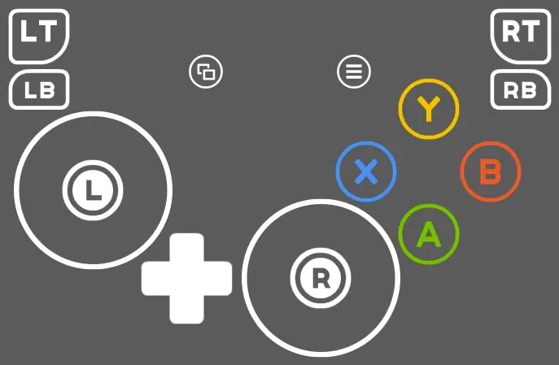
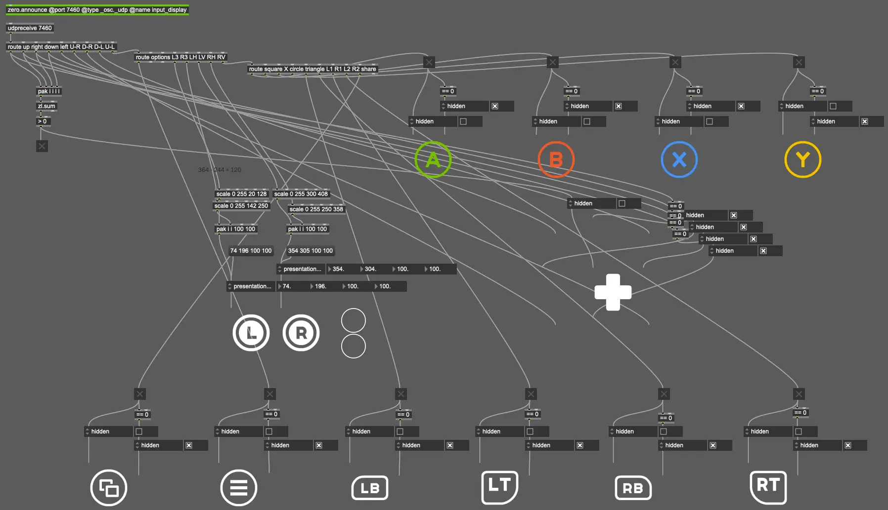

# :studio_microphone: Introduction

This is a rudimentary input display made with Max/MSP for Xbox controllers.

It uses the [zero package](c74max://packagemanager/zero) to communicate with [SousaFX](https://doc.sousastep.quest/index.html).

# :two_men_holding_hands: Attributions

The pngs are from [Kenney's Input Prompts](https://kenney.nl/assets/input-prompts) (CC0)

The svg is from [joypixels' Emojione Mono Emojis](https://www.svgrepo.com/svg/404309/white-circle) (MIT)

